# Team Project: *Group 10*

This report details the work that was completed by together by all team members for the Implementation phase of the project.
## Team members
1. *Team member 1 - BoWen Zhang @Steven_Zhang*
1. *Team member 2 - HaiYi Jin @Hardypriem*
1. *Team member 3 - Xiao Ma @Watts20372212*
1. *Team member 4 - TianYu Zeng @Rony20205765*

# Implementation

This part includes the implementation of the library management system. In order to execute the application you will need to have the following installed:
1. Java 17
2. Maven

# Running the Application	
1. Clone the project   
   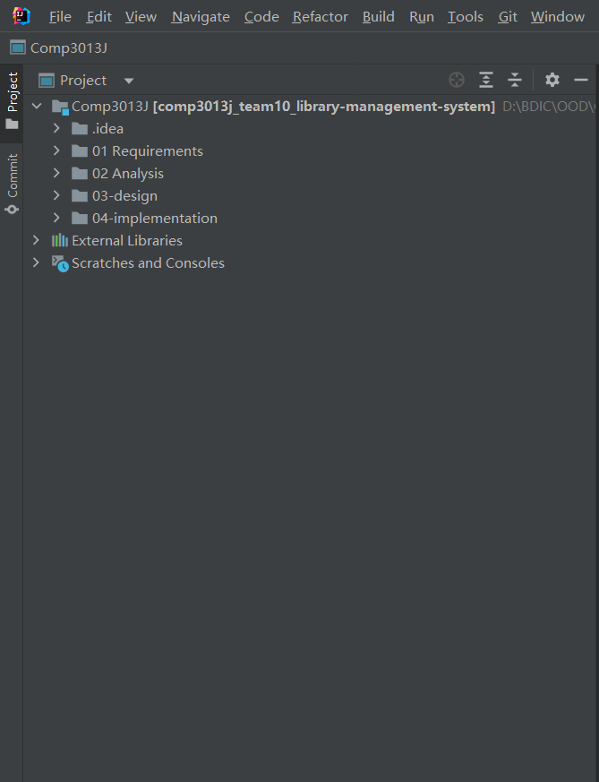
2. Click file to go to directory 04-implementation, the construction should be show like this   
   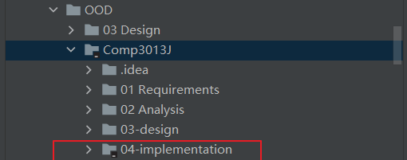   
   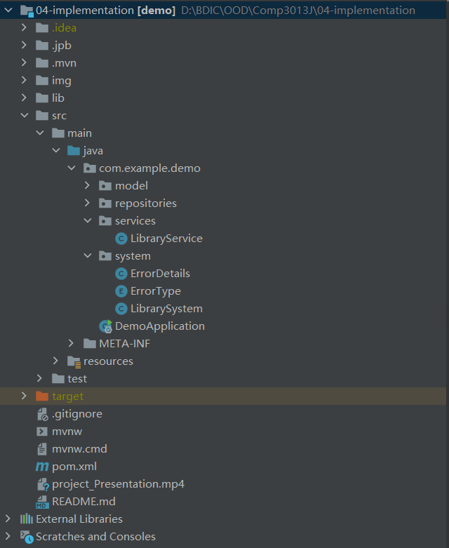
3. Click database on the right to add a mysql Datasource   
   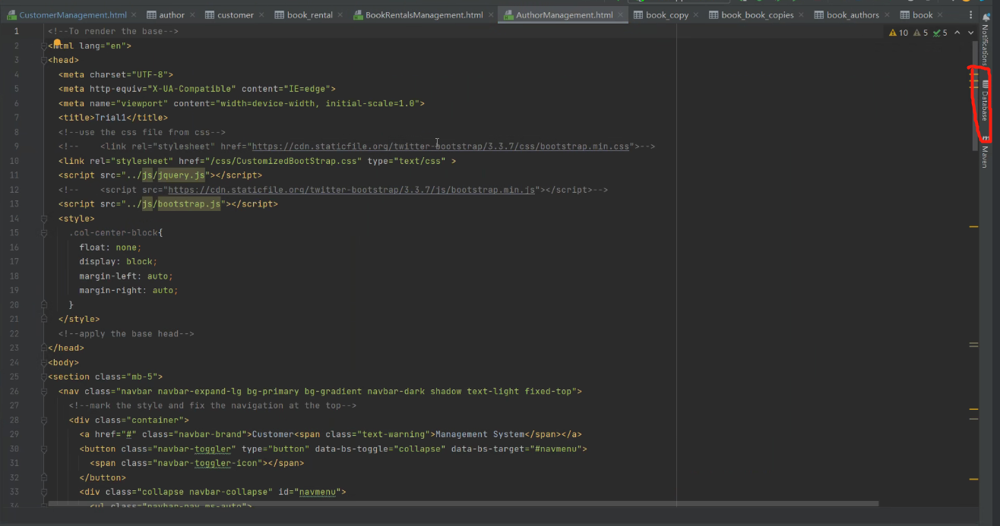
4. Enter the mysql username and password   
   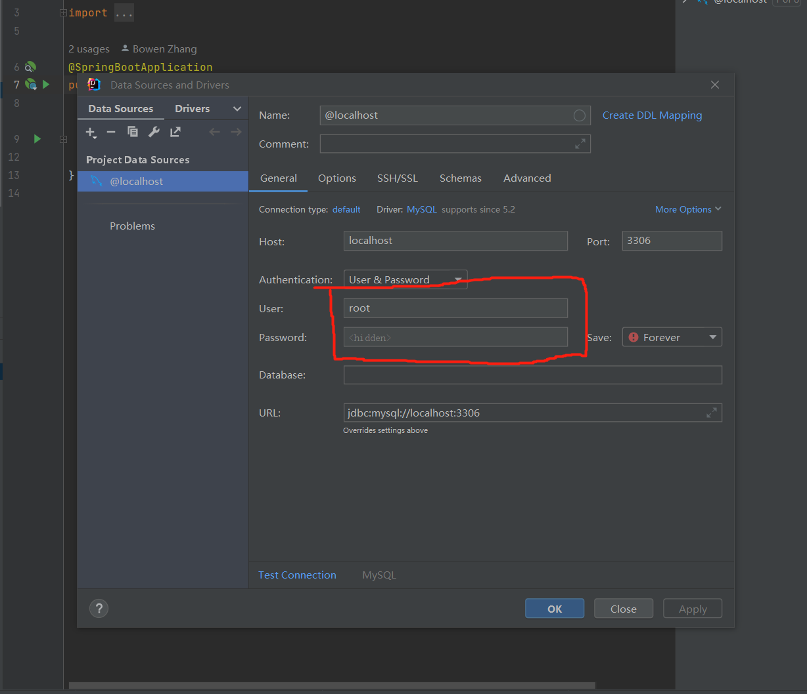
5. Click Apply
6. Right-click on the new Datasource and create a new schema called library   
   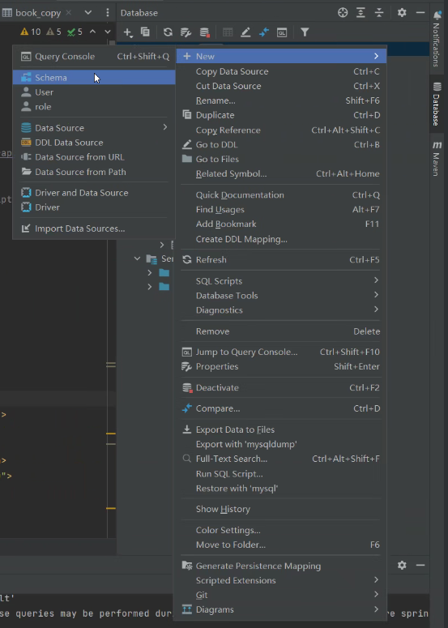  
   
   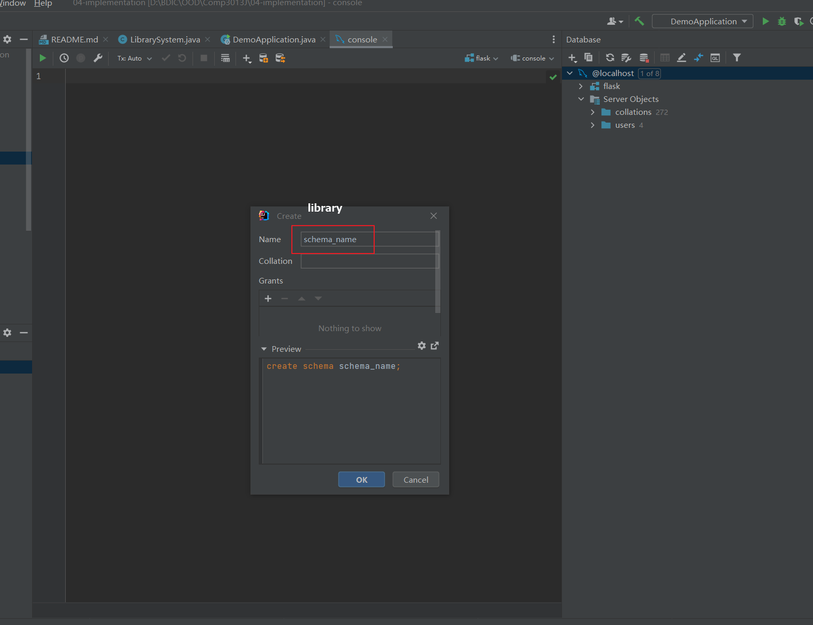
7. Change the username and password in application.yaml   
   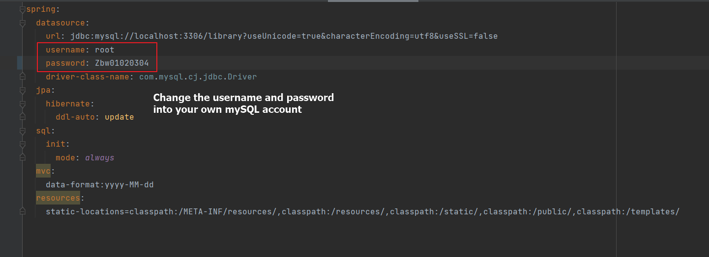
8. Run DemoApplication   
   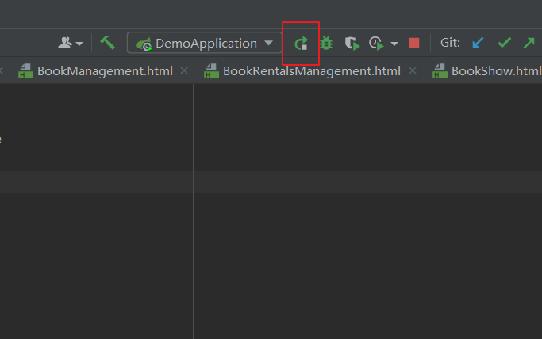
9. Copy the password in command line   
   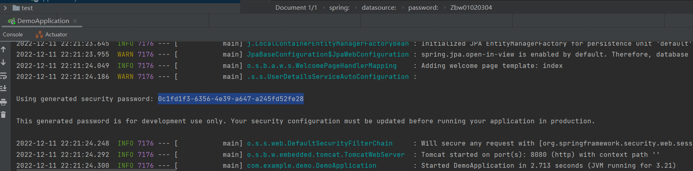
10. Open a browser and type localhost:8080. Enter the landing page   
   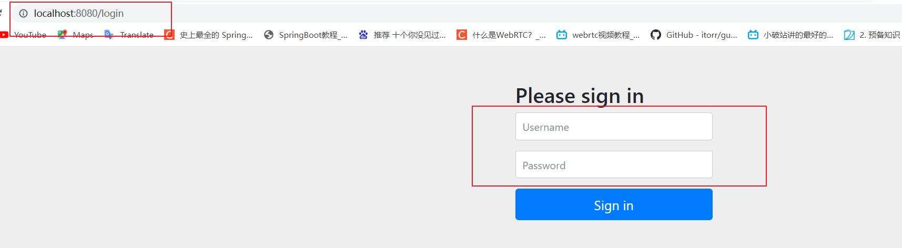
11. By default, the username is user and the password is the one you just copied   
12. Go to the home page and click Init Database Here   
   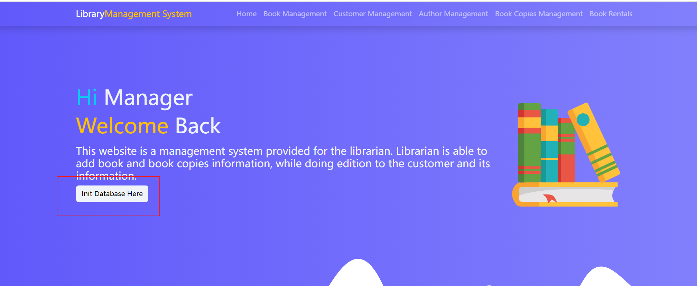
13. Test function   

## Milestone 4 Implementation 

### Distribution of work on this phase

| Item                             | TM1 | TM2 | TM3 | TM4 | Notes on item |
|----------------------------------|-----|-----|-----|-----|---------------|
| model implementation | 20% | 30% | 20% | 30% | Required 6 classes to implement |
| Repositories Implementation | 20% | 30% | 30% | 20% | Requires 5 interface to created |
| Library Service Implementation | 30% | 20% | 20% | 30% |  |
| System Implementation | 25% | 25% | 25% | 25% | |
| FrontEnd page Implementation | 30% | 20% | 30% | 20% | Requires 9 pages to implement |
| FrontEnd & BackEnd Integration | 25% | 25% | 25% | 25% | |

### Reflection Statements
| Team Member | Contribution Reflection Statement |
|-------------|-------------------|
|TM1| In the 04 implementation part, I am involved in all the development component in terms of model implementation, repository implementation, some methods' implementation in  libraray system and the front-end and backend integration. I am mainly in charge of the library service implementation and the frontEnd design. |
|TM2| In the 04 implementation section, I participated in all development components, including most of the model implementation and repository implementation, some methods in the system, service, and  integration between front-end and back-end. I'm mainly responsible for the libaray system implementation and database relasionship maintain. |
|TM3| In the 04 implementation part, I’m involved in all the development component, especially in model implementation, Library Service implementation and System implementation and I partly participated in Repositories implementation, front-end and back-end integration and warehouse implementation. |
|TM4| In the 04 implementation section, I participated in all development components, including implementation of models and Repositories, implementation of some methods in the repository system, and front-end and back-end integration. I'm mainly responsible for the warehouse implementation and the FrontEnd page |
